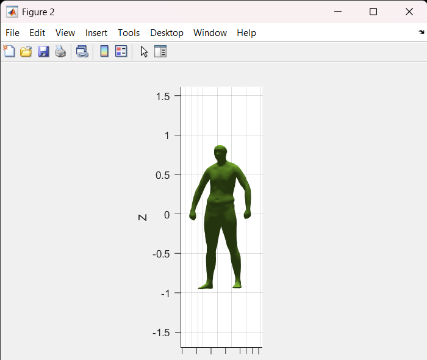
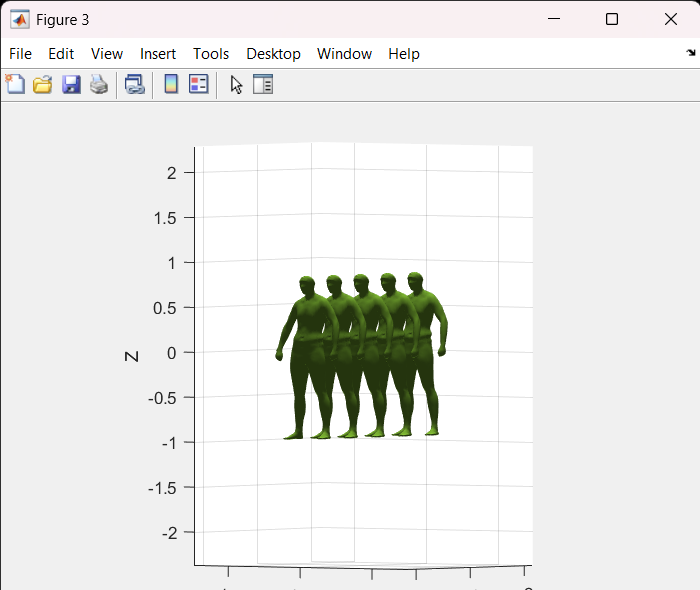
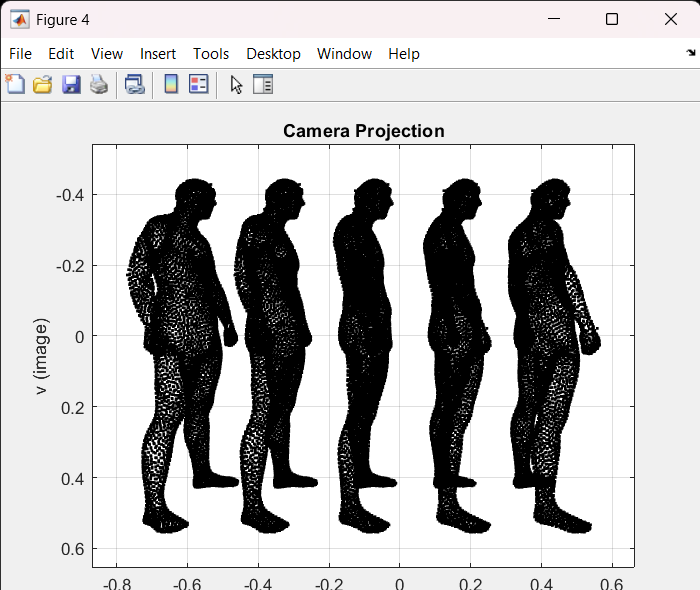

# 3D Camera Projection

## Overview
This project demonstrates the process of 3D camera projection, where a 3D model is transformed into 2D coordinates using camera transformation techniques. The program allows you to manipulate a 3D object (in this case, a 3D human figure) and visualize its 2D projection from different viewpoints. The resulting 2D coordinates are saved in an Excel file for further analysis.

## Project Structure
The repository contains the following files:
- `man_small.stl`: The 3D object file used as the input for the projection.
- `TransformedCoordinates.xlsx`: The output file that contains the transformed 2D coordinates of the projected 3D object.

## Prerequisites
To run this project, you need the following:
- **MATLAB** (R2020b or later recommended)
- **STL file reading functions** (e.g., `stlread` available via MATLAB's add-ons or external packages)
- Required libraries (MATLAB built-in functions)

## Setup Instructions
1. Clone this repository or download the files to your local machine.
2. Ensure that you have MATLAB installed and the necessary toolboxes for 3D visualization.
3. Place the `man_small.stl` file in the same directory as the script to ensure that the file paths are correct.

## Running the Code

### Step 1: Load the 3D Model
The program begins by reading the 3D model from the `man_small.stl` file using the `stlread` function. The vertices and faces of the model are extracted.

### Step 2: Visualize the 3D Model
The 3D model is visualized using MATLAB’s `patch` function, where you can interact with the object in 3D. You can rotate the model to examine it from different angles.

### Step 3: Duplicate the Model
The code then duplicates the 3D model (5 humans stacked with a vertical shift) and visualizes them in a new figure. This step demonstrates how to manipulate the object’s position in 3D space.

### Step 4: Apply Camera Transformation
A camera transformation matrix is created based on a rotation matrix (`R`) and a translation vector (`t_cam`). These are used to simulate how the object would look from the camera’s perspective.

### Step 5: Project 3D to 2D
The 3D object is projected into 2D space by multiplying the 3D vertices with the camera transformation matrix. The result is a set of 2D coordinates corresponding to the 3D model's projection.

### Step 6: Save the Results
The 2D coordinates of the projected object are saved in an Excel file (`TransformedCoordinates.xlsx`). This file contains the 2D image coordinates of all the vertices after the camera transformation.

### Example Output
Here’s an example of what the 2D projection coordinates might look like (saved in the `TransformedCoordinates.xlsx` file):

| ID  | u-coordinate | v-coordinate |
| --- | ------------ | ------------ |
| 1   | 0.457037527502059        | 0.453048396071079        |
| 2   | 0.0530324600826522        | 0.0566489310788481      |
| 3   | 1        | 1        |
| ... | ...          | ...          |

### Plot of 2D Coordinates
The script will also generate a 2D plot showing the projected points (`u`, `v`), which will represent how the 3D model appears when viewed from the camera.

## File Descriptions
- **`man_small.stl`**: The 3D human model used as input for the projection.
- **`TransformedCoordinates.xlsx`**: Excel file containing the transformed 2D coordinates after the camera projection.

## Code Explanation

### Main Steps:
1. **Read 3D Model**: `stlread("man_small.stl")` reads the 3D model file.
2. **Visualization**: The `patch` function is used to visualize the 3D object and its duplicated versions.
3. **Camera Transformation**: The rotation (`R`) and translation (`t_cam`) matrices define the camera transformation.
4. **Projection**: The transformation is applied to the 3D vertices, and the 2D coordinates are extracted by normalizing the results.
5. **Output**: The final 2D coordinates are saved in an Excel file (`TransformedCoordinates.xlsx`).

### Example of Transformations
A camera rotation and translation matrix (`R`, `t_cam`) is created, and the vertices are multiplied by the transformation matrix to simulate a real-world camera projection.

## Conclusion
This project demonstrates a simple 3D to 2D camera projection using MATLAB. By manipulating the vertices and applying transformation matrices, you can simulate different camera viewpoints and visualize the resulting projections.
